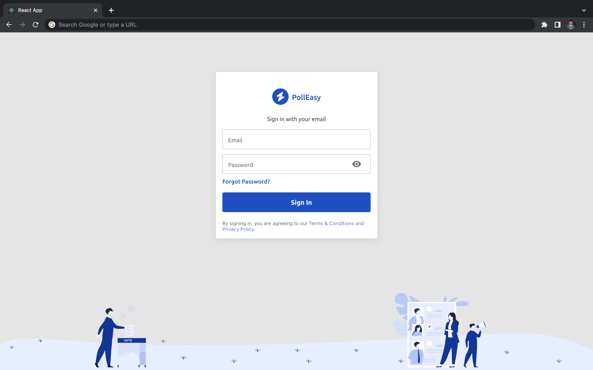

# ✨ Welcome to PollEasy

## Description ✍︎

PollEasy is a platform that helps to collect data and layer analytics on it to manage election.



## Technologies Used ⚙︎

- ReactJs
- React-Query
- Axios
- Material-UI

# Getting Started

## Prerequisites

The following should be installed in your machine.

- [Node.Js](https://nodejs.org/en/download/)
- [Yarn](https://yarnpkg.com/)

## How To Install And Run The Application

- Clone this [Repo](https://github.com/Prunedge-Dev-Team/polleasy-web) and `cd` into it
- Create a `.env` file and add `SKIP_PREFLIGHT_CHECK=true`
- Install the dependencies by running `yarn install`
- Start the application on development mode by running `yarn start`

## Project structure

This repository has the following structure:

<!-- If you make any changes in the project structure, remember to update it. -->

```text
  ├── .github                     # Definitions of Github workflows, pull request and issue templates
  ├── src
       ├── assets                 # Various files like images used in website
       ├── components             # Various generic components
       ├── constant               # Constant data doesn't change within the application lifecycle
       ├── context                # Various React's contexts used in website
       ├── ErrorBoundary          # React's components that catches JS errors anywhere within the child component tree
       ├── hooks                  # Various reuseable functions that uses React's internal Hooks
       ├── modules
            ├── Super-Admin
                  ├── components  # Various reuseable components belonging to Super Admin
                  ├── pages       # Various UI screen belonging to Super Admin
                  ├── routes      # Various routes belonging to Super Admin
                  ├── Services    # Various API service belonging to Super Admin
                  ├── validation  # Various Form validation belonging to Super Admin
                  ├── index       # Index file with Layout for Super Admin
            ├── Administrator (Admin)
                  ├── components  # Various reuseable components belonging to Admin
                  ├── pages       # Various UI screen belonging to Admin
                  ├── routes      # Various routes belonging to Admin
                  ├── Services    # Various API service belonging to Admin
                  ├── validation  # Various Form validation belonging to Admin
                  ├── index       # Index file with Layout for Admin
            ├── Party Candidate & Party Campaign Manager
                  ├── components  # Various reuseable components belonging to Party Candidate/Manager
                  ├── pages       # Various UI screen belonging to Party Candidate/Manager
                  ├── routes      # Various routes belonging to Party Candidate/Manager
                  ├── Services    # Various API service belonging to Party Candidate/Manager
                  ├── validation  # Various Form validation belonging to Party Candidate/Manager
                  ├── index       # Index file with Layout for Party Candidate/Manager
            ├── Call Group
                  ├── components  # Various reuseable components belonging to Call Group
                  ├── pages       # Various UI screen belonging to Call Group
                  ├── routes      # Various routes belonging to Call Group
                  ├── Services    # Various API service belonging to Call Group
                  ├── validation  # Various Form validation belonging to Call Group
                  ├── index       # Index file with Layout for Call Group
       ├── pages                  # Various UI Screen that doesn't change
       ├── routes                 # Various global routes
       ├── shared                 # Various global reuseable components
       ├── stories                # Various global reuseable component documentation
       ├── theme                  # Various MUI global theme
       ├── utils                  # Various reuseable function

```

## Issues

Issues are always very welcome. Please be sure to create a constructive issue when necessary.

## Pull Requests

Pull request are welcome if anything is missing or something is buggy. However, there are a couple of things you can do to make life easier for the maintainers.

- Explain the issue that your PR is solving - or link to an existing issue
- Follow the repository structure, and new sections in the corresponding folders
- Ask questions if unclear

## How To Contribute

Please refer to the [contributing guidelines](CONTRIBUTING.md)

> TL;DR: we use Prettier and ESLint, we do like great commit messages.

## Testing 🔬

> WIP

## Components documentation 📜

> WIP

## Deployment 🚀

[Netlify](https://polleasy.netlify.app/)
